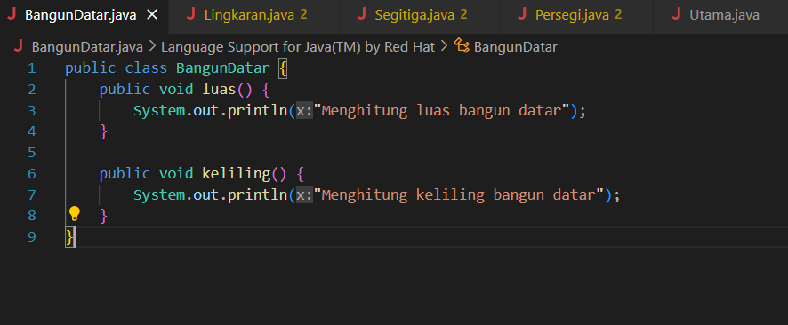
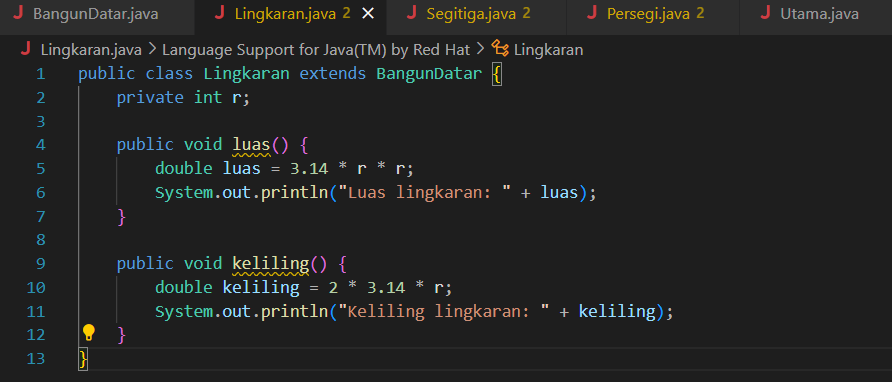
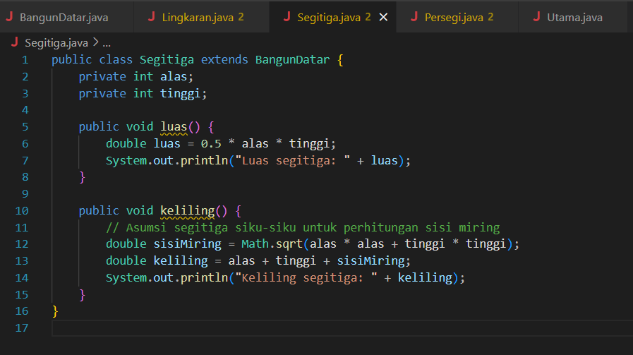
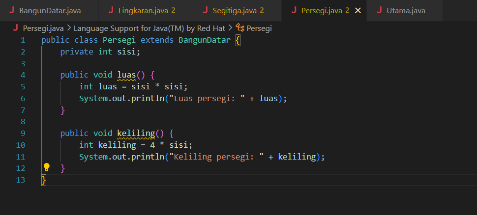
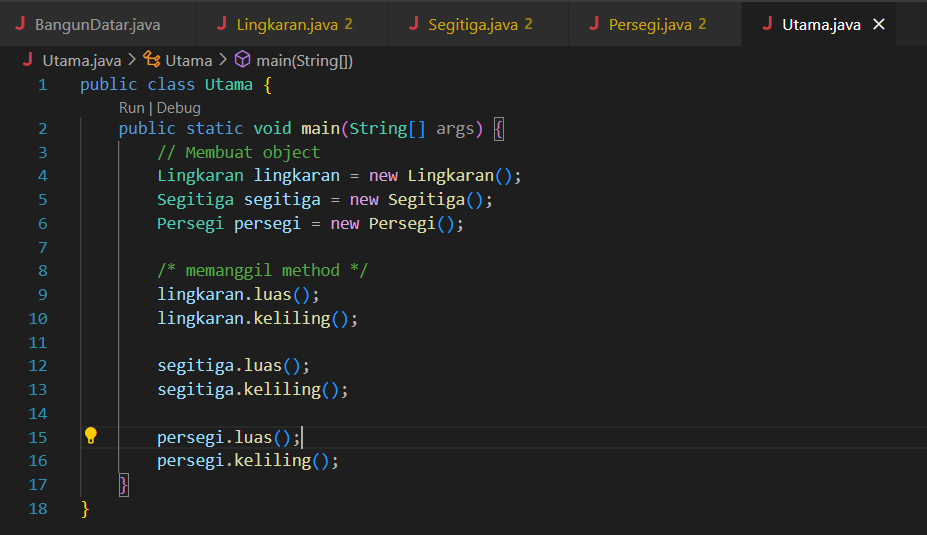
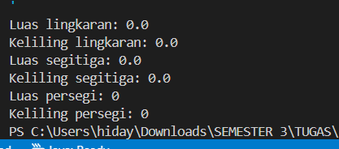

# polimorfisme
```
NIM     : 312310576
NAMA    : TAUFIK HIDAYAT
KELAS   : TI.23.A6
MATKUL  : Pemrograman Orientasi Objek
```
## Penjelasan
#### 1.Konsep Dasar:
- contoh Polimorfisme dalam Java BangunDatar adalah parent class (kelas induk)
- Lingkaran, Segitiga, dan Persegi adalah child classes (kelas anak),
- Lalu Setiap child mengimplementasikan method luas() dan keliling() secara berbeda.

#### 2.Struktur Class:
```
// Parent class
class BangunDatar {
    // Method umum yang akan diwariskan
    public void luas() { ... }
    public void keliling() { ... }
}

// Child classes
class Lingkaran extends BangunDatar { ... }
class Segitiga extends BangunDatar { ... }
class Persegi extends BangunDatar { ... }
```
#### 3.Keuntungan
- Satu variable BangunDatar bisa menampung berbagai jenis Methode
- bisa menerima semua jenis bangun datar
- Pemanggilan method yang sama menghasilkan perhitungan yang berbeda sesuai bentuk


## image source code java
### BangunDatar

### Lingkaran

### Segitiga

### Persegi

### Utama


- Java secara otomatis memanggil implementasi method sesuai objek sebenarnya
Terjadi saat program dijalankan.
## Berikut Ouput nya:



# Selesai & Terimakasih.

  
